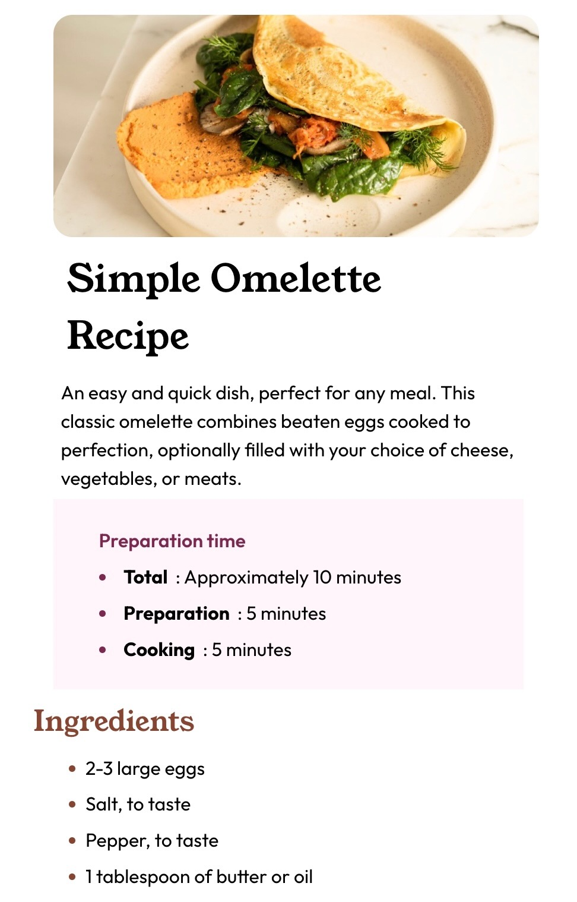

# Frontend Mentor - Recipe page solution

This is a solution to the [Recipe page challenge on Frontend Mentor](https://www.frontendmentor.io/challenges/recipe-page-KiTsR8QQKm). Frontend Mentor challenges help you improve your coding skills by building realistic projects. 

## Table of contents

- [Overview](#overview)
  - [The challenge](#the-challenge)
  - [Screenshot](#screenshot)
  - [Links](#links)
- [My process](#my-process)
  - [Built with](#built-with)
  - [Continued development](#continued-development)
- [Author](#author)

**Note: Delete this note and update the table of contents based on what sections you keep.**

## Overview

### Screenshot

### Links

- Solution URL: [Preview Code](https://github.com/Stanley-24/Recipe-page-solution.git)
- Live Site URL: [Preview Website](https://recipe-page-solution.vercel.app/)

## My process

### Built with

- Semantic HTML5 markup
- CSS custom properties
- Flexbox
- CSS Grid

### Continued development

I'm happy to participate on this challenge as i'm currently learning web development now, i'm still having issue getting the right spacing and padding but i'm learning and definitely going to master it soon 

## Author

- Website - [Stanley Owarieta](https://stanley-24.github.io/Landingpage/)
- Frontend Mentor - [@Stanley-24](https://www.frontendmentor.io/profile/Stanley-24)
- Linkedin - [@Stanley Owarieta](https://www.linkedin.com/in/stanley-owarieta-9127042b7/)
- Github [Stanley-24] (https://github.com/Stanley-24)

